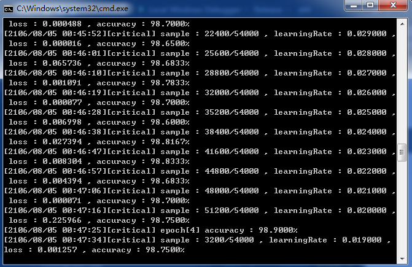

## EasyCNN
Easy convolution neural network framework. 
 
small, clean, easy to understand!

[blog about EasyCNN in Chinese.](http://hongbomin.com/2016/11/12/easycnn-design-history/)

## Features
* All in one: without any dependency, pure c++ implemented.
* Basic layer: data layer, convolution layer, pooling layer, full connect layer, softmax layer, activation layers(sigmod, tanh, RELU)
* Loss function: Cross Entropy, MSE.
* Optimize method: SGD, SGDWithMomentum.
* Multi-thread parallel optimized.
* Tensorflow model support (traditional CNN only now).([link](tools/tf_model_convert/ReadMe.md))

## Examples
* mnist demo, with ConvNet and MLP net,  [examples/mnist/mnist_train_test.cpp](./examples/mnist/mnist_train_test.cpp "mnist_train_test.cpp")  

## Todo List
* ~~fix train error when batch > 1 issue.~~
* ~~add load & save model function.~~
* add more layer, such as batch normalization layer, dropout layer, etc.
* add weight regular.
* port to other platforms, such as linux, mac, android, iOS, etc.
* optimize network train/test speed, use cuBLAS/OpenBLAS etc.
* add more optimize method.
* add unit test.
* ~~add license.~~

## Bug Report
Use [github issues](https://github.com/xylcbd/EasyCNN/issues "issues") please.

## Pull Request
Pull request is welcome.

## License
This project is released under the [WTFPL LICENSE](http://www.wtfpl.net/ "WTFPL LICENSE").
