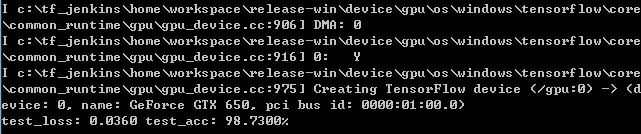
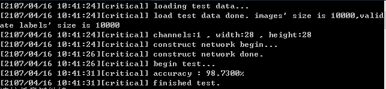

# Tensorflow model converter

### mnist model export example
#### Usage:
* Step[0]  
training mnist CNN model.
* Step[1]  
verify the accuracy of tensorflow model.
* Step[2]  
convert tensorflow model to easycnn model.
* Step[3]  
verify the accuracy of easycnn model.

#### Show me the image

* tensorflow CNN model for mnist: 

* easycnn CNN model for mnist which is converted from tensorflow model  

#### Using the tensorflow model converter
You should custom copy and edit the export_mnist_cnn.py by yourself.